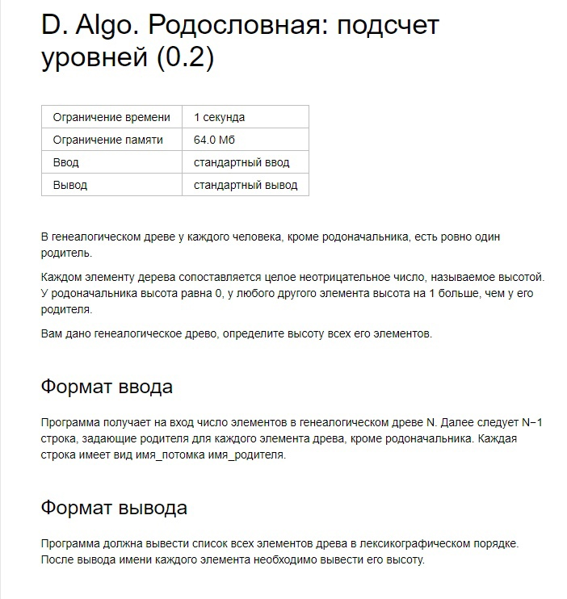

# Algo_Rodoslovnaya

Input:

9

Alexei Peter_I   
Anna Peter_I   
Elizabeth Peter_I  
Peter_II   
Alexei Peter_III   
Anna Paul_I   
Peter_III   
Alexander_I   
Paul_I   
Nicholaus_I   
Paul_I  

Output:

Alexander_I 4  
Alexei 1  
Anna 1  
Elizabeth 1  
Nicholaus_I 4  
Paul_I 3  
Peter_I 0  
Peter_II 2 
Peter_III 2
